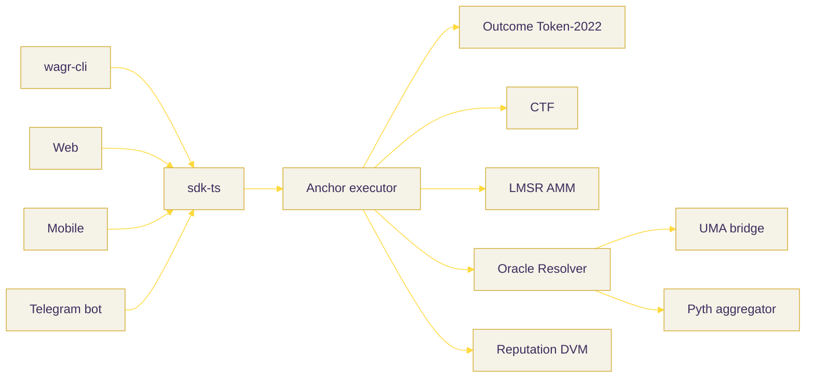

<p align="center">
  
</p>

<h1 align="center">WAGR &mdash; Solana Prediction Market Standard</h1>

<p align="center">
  <a href="./LICENSE"></a>
  <a href="#"></a>
  <a href="https://explorer.solana.com/address/GreSDUbtzBpDRgCYo9sXGZbFDM3HXFQWTdeAacF8HDEc?cluster=devnet"></a>
  <a href="https://www.anchor-lang.com"></a>
  <a href="https://www.rust-lang.org"></a>
  <a href="https://www.typescriptlang.org"></a>
  <a href="#documentation"></a>
  <a href="https://wagr.fi"></a>
  <a href="https://x.com/wagrfi"></a>
  <a href="https://www.npmjs.com/package/wagr-cli"></a>
  <a href="https://www.npmjs.com/package/@wagrlabs/sdk"></a>
</p>

<p align="center"><em>CA: Eb2zbWj8a9oes8t4DC1kjuQEPWgjYCgjGSXqLoLpump</em></p>

<p align="center"><em>Bet the truth.</em></p>

<p align="center">Solana's first prediction market standard. One Anchor program, five outcome modules, three client surfaces.</p>

## Why WAGR

Polymarket is Ethereum's prediction market. Solana has Drift Prediction -- one dApp -- and no shared standard. WAGR is the missing rail: Outcome Token, Conditional Token Framework, Optimistic Oracle, LMSR AMM, and Multi-Outcome markets, all as composable modules over a single Anchor program.



## Documentation

- [Architecture](./docs/architecture.md)
- [Outcome specification](./docs/outcome-spec.md) -- Outcome Token + CTF + LMSR
- [Oracle specification](./docs/oracle-spec.md) -- UMA optimistic, Pyth, multi-source
- [Security model](./docs/security.md) -- bonds, slashing, vault PDAs

## Modules

| Crate | Purpose |
|---|---|
| [`outcome-engine`](./src/outcome-engine) | Outcome Token + Conditional Token Framework |
| [`lmsr-amm`](./src/lmsr-amm) | Hanson 2003 LMSR pricing |
| [`oracle-resolver`](./src/oracle-resolver) | UMA-style optimistic + Pyth + consensus |
| [`reputation-module`](./src/reputation-module) | Dispute DVM with $WAGR slashing |
| [`anchor-program`](./src/anchor-program) | Solana executor (devnet; mainnet pending) |

## Quick Tour

```bash
# Trade-side
cargo test --workspace
pnpm --filter @wagrlabs/sdk build

# CLI
npm i -g wagr-cli
npm i @wagrlabs/sdk
wagr quote --qs 0,0 --b 1000 --outcome 0 --shares 100
wagr split --market 1 --amount 100
wagr propose --market 1 --outcome 0 --bond 1000000
```

## Clients & Status

Live surfaces:

| Surface | State | Where |
|---|---|---|
| Web (landing + Designer + Markets + Docs) | live | https://wagr.fi |
| `wagr-cli` | live on npm | `npm i -g wagr-cli` &mdash; https://www.npmjs.com/package/wagr-cli |
| `@wagrlabs/sdk` | live on npm | `npm i @wagrlabs/sdk` &mdash; https://www.npmjs.com/package/@wagrlabs/sdk |
| Anchor program | live on **Solana devnet** (mainnet pending) | [`GreSDUbtzBpDRgCYo9sXGZbFDM3HXFQWTdeAacF8HDEc`](https://explorer.solana.com/address/GreSDUbtzBpDRgCYo9sXGZbFDM3HXFQWTdeAacF8HDEc?cluster=devnet) |

In development:

| Surface | State |
|---|---|
| Mobile app (`packages/mobile-app`, Solana Mobile SDK) | in development, not published |
| Telegram bot (`packages/telegram-bot`) | in development, not yet running on a public bot |

The architecture diagram above draws Mobile and Telegram as clients because the SDK is wired for them; the surfaces themselves are not yet shipped. The CLI's `create` command is an honest **dry-run preview** today (it prints the instruction body and the chosen accounts; it does not submit on chain).

## Reading List

Designed by reading -- and citing -- the foundational papers in prediction markets:

- Hanson, R. (2003). "Combinatorial Information Market Design." *Information Systems Frontiers*.
- UMA Project (2020). *Optimistic Oracle: A trust-minimised data feed for smart contracts.*
- Gnosis (2019). *Conditional Token Framework.*
- Pyth Network (2021). *Pyth: A High-Frequency Oracle for Solana.*
- Augur v2 (2020). *Decentralised Oracle Protocol.*

## Repository Layout

```
src/
├── outcome-engine/        Rust core -- Outcome Token + CTF
├── lmsr-amm/              Hanson 2003 LMSR + CPMM hybrid
├── oracle-resolver/       UMA optimistic + Pyth + consensus
├── reputation-module/     Dispute DVM + slashing
├── anchor-program/        Solana executor (devnet; mainnet pending)
└── sdk/                   TypeScript developer SDK
```

## License

Apache 2.0 -- see [LICENSE](./LICENSE).
