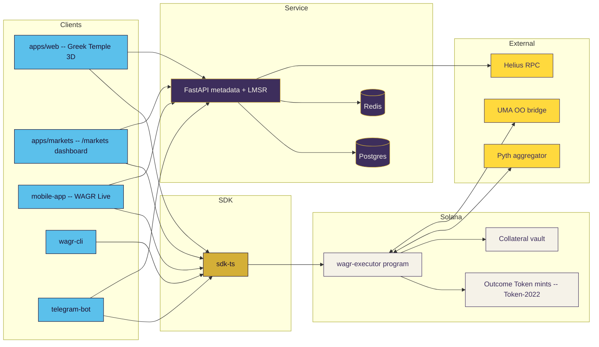
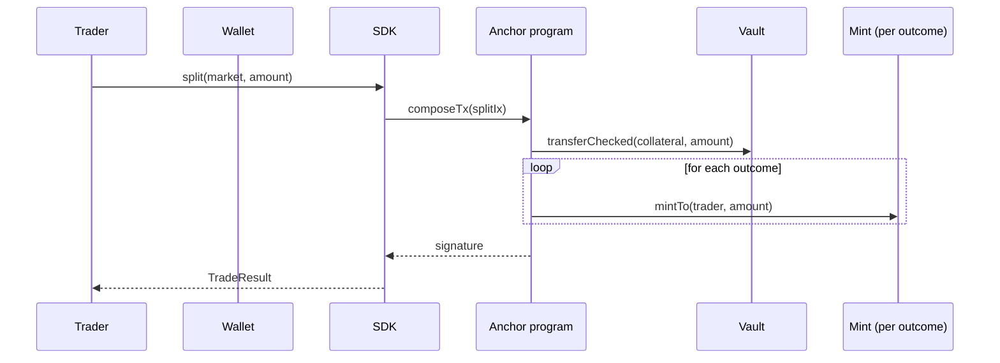
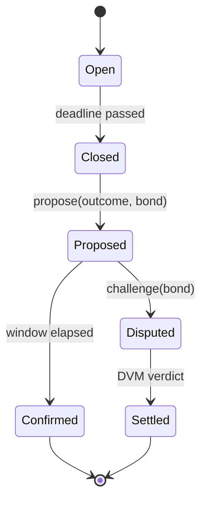

# WAGR Architecture

> Solana's first prediction market standard. One Anchor program, five outcome modules, three client surfaces.

## 1. Top-Level Topology

## 2. Module Map

| Module | Crate / Package | Role |
|---|---|---|
| Outcome Token Standard | `wagr-outcome-engine` | Per-outcome share accounting, Token-2022 binding |
| Conditional Token Framework | `wagr-outcome-engine::ctf` | Split / merge / redeem |
| LMSR AMM | `wagr-lmsr-amm` (+ TS twin) | Hanson 2003 pricing |
| Oracle Resolver | `wagr-oracle-resolver` | UMA optimistic + multi-source consensus |
| Reputation Module | `wagr-reputation-module` | DVM tally + $WAGR slashing |
| Anchor Executor | `wagr-executor` | On-chain glue; thin program |
| SDK | `sdk-ts` | Public client surface |
| Designer | `apps/web/designer` | 1st hook: author + backtest |
| Dashboard | `apps/web/markets` | 2nd hook: live trading |
| Mobile + Bot + CLI | `mobile-app`, `telegram-bot`, `cli` | 3rd hook |

## 3. Trade Lifecycle

## 4. Resolution Lifecycle

## 5. Why Not Use the Existing UMA Bridge?

UMA's mainnet bridge to Solana is an event log without first-class dispute primitives on the Solana side. WAGR ports the **state machine** -- `Proposed → Challenged → Settled` -- so the dispute window, bond accounting, and slashing all live in a single PDA. The bridge is still consulted for the canonical DVM verdict; we just refuse to let traders touch the locked collateral until the local state confirms.

## 6. Why LMSR, Not pure CPMM?

For thinly traded markets a constant-product invariant gives terrible price discovery (the first $10 of YES quote moves the price 20 points). LMSR bounds the AMM's worst-case loss at `b · ln(N)` regardless of volume, which is the right shape during bootstrap. Once a market crosses a configurable depth threshold we switch to CPMM to save gas.

## 7. Security Boundary

- Trader wallets sign every state-changing instruction.
- The vault is owned by a PDA derived from `(b"market", market_id)`; the program is the only account that can transfer collateral out.
- `HELIUS_RPC_URL` lives **only** in `service/` and `apps/web/app/api/das/route.ts`. The wallet adapter uses a public RPC.
- The dispute path is funded entirely by bonds; the protocol takes no custody of voter capital outside the slash window.
