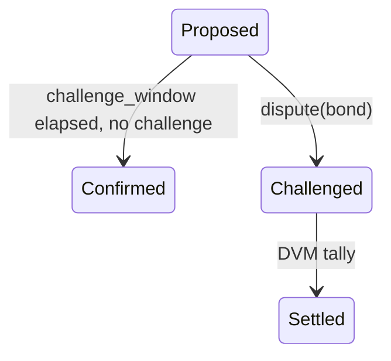
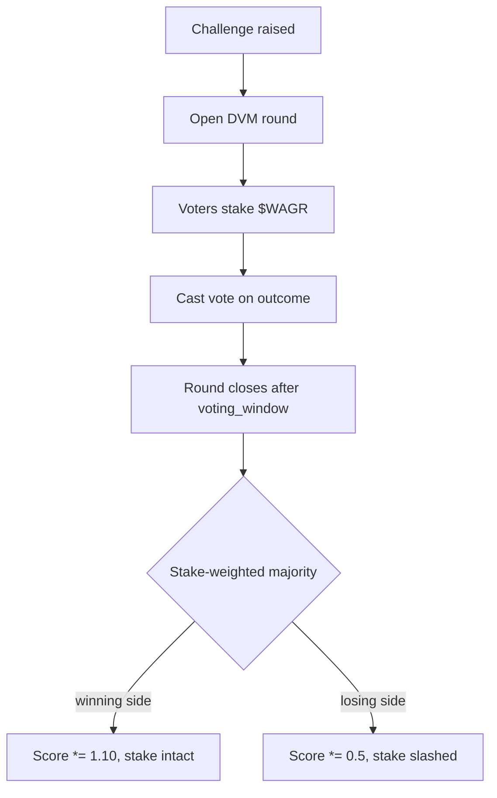

# Oracle Specification

> Three resolution paths: optimistic, aggregated, and bespoke. Every market picks one at creation.

## 1. Optimistic Resolution (UMA-style, on Solana)

Inspired by UMA's Optimistic Oracle (whitepaper, 2020). Adapted for Solana because the existing UMA bridge to Solana is an event log without dispute primitives on the Solana side.



### Bonds

| Actor | Bond |
|---|---|
| Proposer | `bond` ($WAGR or stable; configurable per market) |
| Challenger | `bond` (matching) |
| Winner | full bond back + half of loser's bond |
| Loser | bond seized + reputation slash |

The configurable `challenge_window` defaults to 24h. Markets that resolve on slow data (election results) can set it to 72h.

## 2. Aggregated Feeds (Pyth / Switchboard)

For continuous-data markets (price thresholds, weather, scores), the resolver pulls **M-of-N** aggregated samples and takes the median across non-stale entries.

```python
def resolve_binary(samples, now, threshold, max_staleness, m):
    fresh = [s.value for s in samples if now - s.timestamp <= max_staleness]
    assert len(fresh) >= m
    median = sorted(fresh)[len(fresh) // 2]
    return 0 if median >= threshold else 1
```

Default settings: `m = 3`, `max_staleness = 60s`, sources sourced from Pyth product feeds + Switchboard v3 oracles + an optional in-house attestation node.

## 3. Manual

For test markets and off-chain games (esports brackets, governance polls). `resolution_source = Manual { authority }`. The authority signs a single transaction setting `winning_outcome`. There is no challenge window -- this mode is for low-stakes flow only.

## 4. Dispute Escalation: Reputation DVM

When the optimistic layer transitions to `Challenged`, control hands off to the **Reputation Module**.



### Reputation Mechanics

- `score` starts at 1.0 (`REP_ONE = 1_000_000` in fixed-point).
- Correct vote: `score *= 1.10`, capped at `REP_MAX = 4.0`.
- Incorrect vote: `score *= 0.5`, floored at `REP_MIN` (so a fully-slashed voter can recover).
- Effective stake in the next tally = `stake * score`.
- Slash rate per incorrect vote = `slash_bps` (default 1000 = 10%).

## 5. Feed Inventory

The off-chain service exposes `/oracle/feeds` so frontends can render available sources. Defaults:

| Source | Type | Notes |
|---|---|---|
| Pyth `SOL/USD`, `BTC/USD`, `ETH/USD`, `JUP/USD`, `BONK/USD` | Aggregated price | Sub-second staleness |
| Switchboard v3 | Aggregated + bespoke | for sports + weather |
| UMA-style optimistic | Bonded proposal | for general questions |
| Multi-source consensus | M-of-N median | for hybrid markets |
| Reputation DVM | Stake-weighted vote | dispute backstop |

## 6. Why Not Just Defer to Pyth?

Pyth is excellent for liquid price feeds and unsuitable for almost anything else. "Did SOL close above $300 on the last day of Q3?" is a multi-step query (which timezone? which close? which aggregator?) that the market author should be able to bind unambiguously at creation. UMA-style optimistic resolution lets the author write the question in human terms and lets the *crowd* enforce the spec via bonded disputes.
