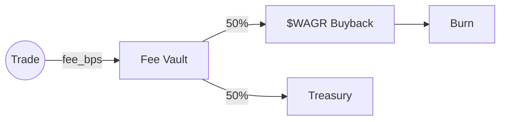

# Outcome Specification

> The shape of an outcome market on the WAGR standard, end to end.

## 1. Outcome Token Standard

Solana port of the Polymarket binary-outcome ERC-1155 pattern.

- One **Token-2022 mint per outcome**. A binary market has 2 mints (`YES`, `NO`); an N-outcome election market has up to 16.
- `mint_authority = PDA(b"market", market_id)`. The program is the only account that can mint or burn.
- Transfer extension: `TransferFeeConfig` is **off** for outcome shares (so retail flow stays free) but **on** for `$WAGR` slashing flows.
- Decimals match the collateral mint (USDC → 6).

### Account Layout

```rust
pub struct OutcomeMarket {
    pub market_id: u64,
    pub authority: Pubkey,            // governance / migration authority
    pub question: String,             // ≤ 256 bytes
    pub outcome_count: u8,            // 2..=16
    pub resolution_deadline: i64,
    pub state: MarketState,
    pub collateral_mint: Pubkey,
    pub collateral_vault: Pubkey,
    pub lmsr_b: u128,
    pub fee_bps: u16,
    pub total_volume: u64,
    pub created_at: i64,
    pub resolution_source: ResolutionSource,
    pub proposed_outcome: u8,
    pub proposed_at: i64,
    pub proposer: Pubkey,
    pub winning_outcome: u8,
    pub shares_q: [u128; 16],         // LMSR share vector
    pub bump: u8,
}
```

## 2. Conditional Token Framework

Three operations, all implemented in `wagr-outcome-engine::ctf` and exposed by the Anchor program. Pure logic crate so simulation, CLI dry-runs, and on-chain execution share the rule set verbatim.

### split

```text
collateral_in = amount
shares_out[i] = amount   for i ∈ 0..outcome_count
fee_taken     = amount × fee_bps / 10_000
```

After a split, the holder holds one outcome share of every outcome. The merge invariant guarantees they can always reclaim `amount` of collateral by burning one share of each.

### merge

```text
require holder.shares[i] >= amount   for every i
burn  amount of each outcome
unlock amount of collateral to holder
```

### redeem

After resolution, only the winning outcome can be redeemed for collateral.

```text
let winner = market.winning_outcome
let payout = holder.shares[winner]
burn payout shares of winner
transfer payout collateral
```

Losing outcomes are not refunded. The collateral that backed them stays in the vault and either funds the buyback or is paid out to the winner side that was over-staked.

## 3. LMSR Pricing

```text
C(q) = b · ln( Σ exp(q_i / b) )
p_i  = exp(q_i / b) / Σ exp(q_j / b)
```

- `b` is fixed per market and bounds the AMM's worst-case loss at `b · ln(N)`.
- Numerical stability: implemented with the standard `logsumexp` trick.
- A trader paying `Δ` shares of outcome `i` pays `C(q + Δe_i) - C(q)` collateral.

## 4. Multi-Outcome Markets

Binary YES/NO is the default. Setting `outcome_count > 2` extends the model:

- The LMSR `q` vector stretches to `outcome_count` entries.
- Prices remain a probability simplex (`Σ p_i = 1`).
- A multi-outcome election market resolves to one canonical index; tournament-style markets are encoded with a "no winner" outcome slot (`outcome_count + 1` slot reserved as 0xFF, redirected through `MarketState::ResolvedInvalid`).

## 5. Fee Flow



Half of every fee buys `$WAGR` on the open market and burns it. The other half funds the treasury (oracle bonds, frontend reliability, marketing).
